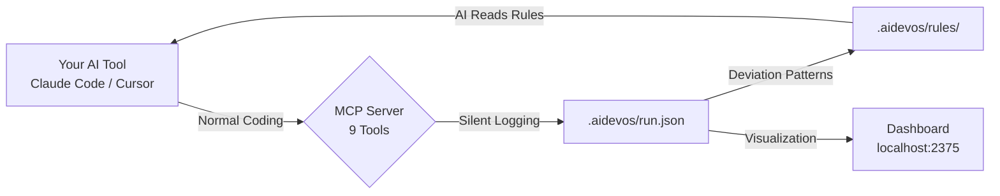

<div align="center">

# AIDA

### Your AI keeps making the same mistakes. AIDA fixes that.

Every AI coding tool hallucinates, misuses components, and ignores project conventions.<br>
*But you close the terminal and the evidence disappears. Next session, same mistakes.*<br>
**AIDA tracks every deviation, finds the patterns, and turns them into rules — so your AI gets smarter with every run.**

```bash
npx ai-dev-analytics init
```

[](https://www.npmjs.com/package/ai-dev-analytics)
[](./LICENSE)
[](https://nodejs.org)
[](#testing)
[](https://lwtlong.github.io/ai-dev-analytics/)

[30-Second Setup](#-30-second-setup) · [The Self-Improving Loop](#-the-self-improving-loop) · [What You See](#-what-you-see) · [Use Cases](#-use-cases) · [中文文档](./README.zh-CN.md)

</div>

---

## The Problem

You've been vibe-coding with Claude for a week. Then you notice:

- **AI generates a form layout — wrong again.** Same `labelPosition` mistake as last time. And the time before that.
- **A component is misused.** AI used `PageLayout` for a detail page, but your project convention is `FormPageLayout`. You corrected it twice already. AI doesn't remember.
- **Spacing is off everywhere.** AI keeps adding `margin-top: 20px` when your design system uses `8px`. Every PR, same feedback.

The root cause: **AI has no memory of its own mistakes.** Each session starts from zero.

AIDA changes that. It records what went wrong, why, and automatically builds a project-specific rule set that your AI reads next time. **Same mistake never happens twice.**

---

## 🔄 The Self-Improving Loop

This is the core of AIDA — not just tracking, but learning.

```
AI generates code → AIDA records deviation (what happened vs. what was expected)
                                    ↓
                    Root cause identified → "rule-missing" / "hallucination" / "context-insufficient"
                                    ↓
                    Pattern detected → Auto-sediment as project rule
                                    ↓
                    AI reads .aidevos/rules/ next session → Same mistake eliminated
```

**Real example from a production project:**

| Run | Deviation | What happened | Rule sedimented |
|-----|-----------|---------------|-----------------|
| #1 | DEV-02 | AI used `labelPosition: 'right'` | "Edit forms must use `labelPosition: 'top'`" |
| #1 | DEV-03 | AI wrapped props in `:formProps={}` | "FormJ attrs must be passed directly" |
| #1 | DEV-05 | AI used `PageLayout` for detail page | "Detail pages must use `FormPageLayout`" |
| #1 | DEV-20 | AI added `onActivated` refresh | "List refresh must use event bus, not `onActivated`" |
| #2 | — | **Zero repeat deviations.** AI read the rules. | — |

After 47 tasks and 23 deviations, this project accumulated 6 rules. Run #2 had **zero repeat errors** on the same patterns.

Your `.aidevos/rules/` directory becomes a **project-specific AI knowledge base** that grows smarter with every run.

---

## Dashboard

**Deviations, bugs, tasks, time, tokens, rules — everything your AI did, structured and visualized.**


> **[Live Demo →](https://lwtlong.github.io/ai-dev-analytics/)** Real anonymized project data. No install needed.

Run `npx ai-dev-analytics dashboard` to see **your own project data** in seconds.

<details>
<summary>🔒 Privacy: all data stays local</summary>

AIDA writes JSON files to `.aidevos/` in your project directory. No telemetry, no cloud sync, no external calls. Your code never leaves your machine.

</details>

---

## ⚡ 30-Second Setup

### Already using Claude Code? Add one config — done.

Create or edit `.mcp.json` in your project root:

```json
{
  "mcpServers": {
    "aida": {
      "command": "npx",
      "args": ["-y", "ai-dev-analytics", "mcp"]
    }
  }
}
```

That's it. AIDA auto-creates everything on first use. Zero workflow changes — your AI calls the MCP tools silently as it works.

> *Tip: For faster startup, run `npm install -g ai-dev-analytics` and change the command to `"aida"`.*

<details>
<summary>Cursor / VS Code Copilot / Windsurf</summary>

**Cursor** `.cursor/mcp.json`:
```json
{
  "mcpServers": {
    "aida": {
      "command": "npx",
      "args": ["-y", "ai-dev-analytics", "mcp"]
    }
  }
}
```

**VS Code Copilot** `.vscode/mcp.json`:
```json
{
  "servers": {
    "aida": {
      "command": "npx",
      "args": ["-y", "ai-dev-analytics", "mcp"]
    }
  }
}
```

**Windsurf** `~/.codeium/windsurf/mcp_config.json`:
```json
{
  "mcpServers": {
    "aida": {
      "command": "npx",
      "args": ["-y", "ai-dev-analytics", "mcp"]
    }
  }
}
```
</details>

### See your data

```bash
npx ai-dev-analytics dashboard
```

Open `http://localhost:2375` — real-time updates via SSE, Chinese/English toggle built in.

---

## 🤔 Why You Need This

**AI doesn't learn from its mistakes. You need a system that does it for AI.**

| Without AIDA | With AIDA |
|---|---|
| "AI keeps getting the layout wrong" | "9 layout deviations tracked. Root cause: `hallucination` (56%), `rule-missing` (44%). 4 rules sedimented → zero repeats" |
| "I corrected this three times already" | "DEV-03 auto-sedimented: 'FormJ attrs must be passed directly'. AI reads it every session now" |
| "That feature had a lot of bugs" | "5 bugs, 3 critical — all in the database migration phase. Bug-to-task ratio: 10.6%" |
| "What did I even do this quarter?" | "47 tasks, 23 deviations fixed, 6 rules sedimented, 4064 lines added. Export → H1 performance review" |

The difference: **AI that keeps forgetting vs. AI that compounds its knowledge.**

---

## 📊 What You See

### Deviation & Quality Intelligence

| Category | Metrics |
|----------|---------|
| **Deviation Analysis** | Root cause breakdown (rule-missing / hallucination / context-insufficient), deviation category distribution, trend over time |
| **Bug Tracking** | Severity distribution, source analysis, bug-to-task ratio, fix time |
| **Review Quality** | Self-review pass rate trend, issue type distribution, first-pass rate |
| **Rules** | Sedimented rules list, source deviation mapping, category coverage |

### Development Lifecycle

| Category | Metrics |
|----------|---------|
| **Tasks** | Completion by phase, time per task TOP 10, stage time distribution |
| **Files** | Modification hotspots, lines added/removed, change frequency |
| **Timeline** | Full development history — every task, bug, review, deviation, chronologically |
| **Token Usage** | Total tokens, input/output/cache breakdown, per-task consumption |

### Project Overview (for teams)

- Requirement status across all branches
- Developer efficiency comparison
- Cross-branch aggregated stats

Every KPI card is clickable — drill into task details, deviation root causes, review reports, and file changes.

### Data You Can Export

All data lives in structured JSON. Pull it for:
- **H1 / H2 performance reviews** — tasks completed, quality metrics, lines of code
- **Annual reports** — cross-project trends, deviation patterns, rule growth
- **Sprint retrospectives** — what went wrong, what rules were added, quality improvement over time
- **Team lead dashboards** — who has the most deviations? which modules need better rules?

---

## 🎯 Use Cases

**Vibe Coder — "Why does AI keep making the same mistake?"**
> You notice AI keeps misusing your component library. After a week with AIDA, the dashboard shows: 9 deviations, all `component-usage` category, root cause `rule-missing`. AIDA sedimented 3 rules. Next run, AI reads the rules — zero component misuse.

**Tech Lead — "Which developer's AI workflow needs tuning?"**
> Team of 4 uses Claude Code daily. Project overview: Developer A has 2 deviations and 5 sedimented rules. Developer B has 15 deviations and 0 rules. B's AI isn't learning because no one is recording the patterns. Time to set up AIDA on B's workflow.

**Senior Engineer — "Show me the data for my performance review"**
> End of H1. Open the dashboard: 150 tasks across 3 features, 89% first-pass review rate, 12 rules sedimented that now benefit the entire team. Export the data, attach to your review doc. Data beats "I think I did a lot."

**Open Source Maintainer — "Is AI-generated code actually good enough?"**
> You accept AI-generated PRs. AIDA shows: AI handles boilerplate at 98% pass rate but struggles with API design (60% pass rate, 8 deviations). You add API design rules — next quarter, pass rate jumps to 85%.

---

## ⚙️ How It Works



Your AI tool calls MCP tools automatically as it works. You don't invoke them manually. No prompts to write, no scripts to run.

<details>
<summary>📋 9 MCP Tools (auto-collected)</summary>

| Tool | What it captures |
|------|-----------------|
| `aida_task_start` | Task begins — ID, title, stage, PRD phase |
| `aida_task_done` | Task completed — duration auto-calculated |
| `aida_log_bug` | Bug found — severity, title, related files |
| `aida_bug_fix` | Bug fixed — links fix to original bug |
| `aida_log_review` | Code self-review — pass/fail, issue list |
| `aida_log_deviation` | AI output ≠ expectation — root cause, category |
| `aida_log_files` | File changes — auto-scans `git diff`, zero args needed |
| `aida_highlight` | Notable achievement worth recording |
| `aida_status` | Current run status snapshot |

For **Claude Code** users, AIDA also auto-collects token usage from session files — input, output, cache creation, cache read tokens — broken down per task.

</details>

### Data Model

All data is local JSON. No database, no cloud.

| Level | File | What it contains |
|-------|------|-----------------|
| **Run** | `.aidevos/runs/{branch}/{dev}/run.json` | Every task, bug, deviation, review, file change, token |
| **Branch** | `.aidevos/runs/{branch}/requirement.json` | Aggregated stats per requirement |
| **Project** | `.aidevos/index.json` | Cross-branch overview for team leads |
| **Rules** | `.aidevos/rules/` | Sedimented project rules — your AI's growing knowledge base |

---

## 🚀 Full Workflow Mode

Beyond data collection, AIDA offers structured AI development workflows.

```bash
aida init    # Select "Full workflow"
aida start   # Create a development run
```

This enables 14 AI skills — requirement analysis, task decomposition, code generation, self-review, bug fixing — with the deviation → rule feedback loop built in.

---

<details>
<summary>🖥 CLI Reference</summary>

```bash
aida init              # Interactive project setup
aida start             # Create a new development run
aida status            # Show current run status
aida dashboard         # Launch dashboard (default port 2375)
aida dashboard -p 3000 # Custom port
aida mcp               # Start MCP server (for AI tool config)
aida log <subcommand>  # Write structured data (task, bug, review, etc.)
aida reindex           # Rebuild project-level index
aida report            # Generate performance report
aida rules build       # Generate rule view files from registry
aida rules dedupe      # Find and remove near-duplicate rules
aida rules merge       # Merge rules from parallel branches
aida update            # Update skills to latest version
aida migrate           # Migrate old data to current schema
```

</details>

<details>
<summary>🔌 MCP Integration Details</summary>

AIDA uses [Model Context Protocol](https://modelcontextprotocol.io/) — the standard way for AI tools to interact with external systems. The MCP server runs over stdio with zero dependencies.

**What happens when you add the config:**

1. Your AI tool discovers AIDA's 9 tools via MCP
2. As the AI works, it naturally calls `aida_task_start`, `aida_log_files`, etc.
3. Data flows into `run.json` silently
4. Deviation patterns emerge → rules get sedimented
5. AI reads rules next session → output quality improves

**No prompts to write. No scripts to run. No workflow to learn.**

</details>

---

## Roadmap

- [ ] Export reports as PDF / HTML (H1/H2 performance reviews)
- [ ] Historical trend analysis — deviation reduction over time
- [ ] Team dashboard with multi-project aggregation
- [ ] VS Code extension for inline deviation alerts
- [ ] Webhook integrations (Slack, Discord, GitHub Issues)
- [ ] Cross-project rule sharing — team-wide AI knowledge base

---

## Tech Stack

| | |
|---|---|
| **Runtime** | Node.js + TypeScript, zero dependencies |
| **Dashboard** | React 19 + ECharts + Tailwind CSS 4 |
| **Protocol** | MCP over stdio (JSON-RPC 2.0) |
| **Data** | Local JSON files, no database |
| **Real-time** | Server-Sent Events (SSE) |
| **i18n** | Chinese / English, switchable in dashboard |

## Testing

```bash
npm test    # 82 tests across 29 suites
```

## Contributing

Issues, feature requests, and PRs are welcome.

```bash
git clone https://github.com/LWTlong/ai-dev-analytics.git
cd ai-dev-analytics
npm install
npm test
```

## License

[MIT](./LICENSE)

---

<div align="center">

**AI doesn't remember its mistakes. AIDA does — and makes sure they never happen again.**

[Get Started in 30 Seconds →](#-30-second-setup)

</div>
