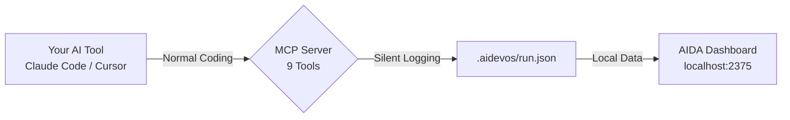

<div align="center">

# AIDA

### AI coding is a black box. AIDA makes it measurable.

You vibe-code with Claude, Cursor, or Copilot every day — but you can't answer basic questions:<br>
*How many tokens did that feature cost? Which task took the longest? Is AI actually saving me money?*<br>
**Stop guessing. Run AIDA. See the data.**

```bash
npx ai-dev-analytics init
```

[](https://www.npmjs.com/package/ai-dev-analytics)
[](./LICENSE)
[](https://nodejs.org)
[](#testing)
[](https://lwtlong.github.io/ai-dev-analytics/)

[30-Second Setup](#-30-second-setup) · [What You See](#-what-you-see) · [How It Works](#️-how-it-works) · [Use Cases](#-use-cases) · [中文文档](./README.zh-CN.md)

</div>

---

## Dashboard

**Token usage, time per task, retry count, pass rate, cost savings — all in one view.**


> **[Live Demo →](https://lwtlong.github.io/ai-dev-analytics/)** No install. No setup. Just open and explore.

Run `npx ai-dev-analytics dashboard` and see **your own data** in seconds — not a demo, your actual project.

<details>
<summary>🔒 Privacy: all data stays local</summary>

AIDA writes JSON files to `.aidevos/` in your project directory. No telemetry, no cloud sync, no external calls. Your code never leaves your machine.

</details>

---

## ⚡ 30-Second Setup

### Already using Claude Code? Add one config — done.

Create or edit `.mcp.json` in your project root:

```json
{
  "mcpServers": {
    "aida": {
      "command": "npx",
      "args": ["-y", "ai-dev-analytics", "mcp"]
    }
  }
}
```

That's it. No `npm install`, no initialization. AIDA auto-creates everything on first use.

> *Tip: For faster startup times (especially in regions with slow npm registries), run `npm install -g ai-dev-analytics` and change the command from `"npx"` to `"aida"`.*

<details>
<summary>Cursor / VS Code Copilot / Windsurf</summary>

**Cursor** `.cursor/mcp.json`:
```json
{
  "mcpServers": {
    "aida": {
      "command": "npx",
      "args": ["-y", "ai-dev-analytics", "mcp"]
    }
  }
}
```

**VS Code Copilot** `.vscode/mcp.json`:
```json
{
  "servers": {
    "aida": {
      "command": "npx",
      "args": ["-y", "ai-dev-analytics", "mcp"]
    }
  }
}
```

**Windsurf** `~/.codeium/windsurf/mcp_config.json`:
```json
{
  "mcpServers": {
    "aida": {
      "command": "npx",
      "args": ["-y", "ai-dev-analytics", "mcp"]
    }
  }
}
```
</details>

### See your data

```bash
npx ai-dev-analytics dashboard
```

Open `http://localhost:2375` — real-time updates via SSE, Chinese/English toggle built in.

### Starting a new project?

```bash
npx ai-dev-analytics init      # Interactive setup
npx ai-dev-analytics start     # Create a development run
# ... code with your AI tool ...
npx ai-dev-analytics dashboard  # See what happened
```

---

## 🤔 Why You Need This

**You're already using AI to write code. But you're not measuring anything.**

| Without AIDA | With AIDA |
|---|---|
| "I think AI saved me time" | "AI completed 47 tasks in 95h of processing, replacing 57h of manual work" |
| "Tokens seem expensive this month" | "506K tokens, $2.52 — auth module used 40% of that" |
| "That feature had a lot of bugs" | "5 bugs, 3 critical — all in the database migration phase" |
| "AI keeps making the same mistakes" | "23 deviations tracked, top root cause: rule missing (→ auto-sedimented to project rules)" |

The difference: **gut feeling vs. data you can act on.**

---

## 📊 What You See

### Per-Branch Development View

| Category | Metrics |
|----------|---------|
| **Token Usage** | Total tokens, input/output/cache breakdown, per-task consumption, cost estimation |
| **Time Analysis** | Cumulative time per node, task time ranking TOP 10, phase time distribution |
| **Quality** | Bug severity distribution, deviation root cause analysis, review pass rate trend |
| **Efficiency** | Task completion by phase, first-pass rate trend, file modification hotspots |
| **Cost** | Manual cost vs. AI token cost, savings amount, cost-per-task breakdown |

### Project Overview (for team leads)

- Requirement status across all branches
- Developer efficiency comparison
- Cross-branch aggregated stats

Every KPI card is clickable — drill into task details, deviation root causes, review reports, file changes, and token breakdowns.

**In short: everything your AI did, structured and visualized.**

---

## 🎯 Use Cases

**Solo Developer — "Where did my tokens go?"**
> You vibe-code a feature over the weekend. Monday morning, open the dashboard: 300K tokens, 12 tasks, 2 bugs fixed. The chart shows the form validation task took 5x longer than others. Next time, you write clearer specs for that part.

**Tech Lead — "Is AI actually helping the team?"**
> Your team of 4 uses Claude Code daily. The project overview shows: 150 tasks completed across 8 branches, 15 deviations, 89% first-pass review rate. Developer A has 0 deviations; Developer B has 9. Time for a rules audit on B's workflow.

**Freelancer — "Show the client the ROI"**
> Client asks: "Why should I pay for AI tools?" You open the cost analysis: 40 hours of manual work estimated, AI token cost $3.80. Cost savings: $596. Screenshots → invoice attachment.

**Open Source Maintainer — "Track AI contribution quality"**
> You accept AI-generated PRs. AIDA records which tasks were AI-generated, their review pass rate, and bug rate. Data-driven: AI handles boilerplate well (98% pass) but struggles with API design (60% pass).

---

## ⚙️ How It Works

```
Your AI Tool (Claude Code / Cursor / Windsurf / VS Code)
    │
    │  AI writes code normally — zero workflow changes
    │
    ├──→ MCP Server (9 tools)     ──→  .aidevos/run.json  ──→  Dashboard
    │    auto-called by AI              local JSON files        localhost:2375
    │    zero friction                  git-friendly            real-time SSE
```



Your AI tool calls MCP tools automatically as it works. You don't invoke them manually. No prompts to write, no scripts to run.

<details>
<summary>📋 9 MCP Tools (auto-collected)</summary>

| Tool | What it captures |
|------|-----------------|
| `aida_task_start` | Task begins — ID, title, stage, PRD phase |
| `aida_task_done` | Task completed — duration auto-calculated |
| `aida_log_bug` | Bug found — severity, title, related files |
| `aida_bug_fix` | Bug fixed — links fix to original bug |
| `aida_log_review` | Code self-review — pass/fail, issue list |
| `aida_log_deviation` | AI output ≠ expectation — root cause, category |
| `aida_log_files` | File changes — auto-scans `git diff`, zero args needed |
| `aida_highlight` | Notable achievement worth recording |
| `aida_status` | Current run status snapshot |

For **Claude Code** users, AIDA also auto-collects token usage from session files — input, output, cache creation, cache read tokens — broken down per task.

</details>

### Data Model

All data is local JSON. No database, no cloud.

| Level | File | What it contains |
|-------|------|-----------------|
| **Run** | `.aidevos/runs/{branch}/{dev}/run.json` | Every task, bug, deviation, review, file change, token |
| **Branch** | `.aidevos/runs/{branch}/requirement.json` | Aggregated stats per requirement |
| **Project** | `.aidevos/index.json` | Cross-branch overview for team leads |

---

## 🚀 Advanced: Full Workflow Mode

Beyond data collection, AIDA offers structured AI development workflows with self-improving project rules.

```bash
aida init    # Select "Full workflow"
aida start   # Create a development run
```

This enables 14 AI skills — requirement analysis, task decomposition, code generation, self-review, bug fixing — with a feedback loop that **automatically converts mistakes into project rules**.

```
AI generates code → Self-review catches issue → Record as deviation
                                                       ↓
                                    Is it a pattern? → Sediment as project rule
                                                       ↓
                                    AI reads rules next time → Same mistake never happens again
```

Your `.aidevos/rules/` directory becomes a project-specific AI knowledge base that grows with every run.

---

<details>
<summary>🖥 CLI Reference</summary>

```bash
aida init              # Interactive project setup
aida start             # Create a new development run
aida status            # Show current run status
aida dashboard         # Launch dashboard (default port 2375)
aida dashboard -p 3000 # Custom port
aida mcp               # Start MCP server (for AI tool config)
aida log <subcommand>  # Write structured data (task, bug, review, etc.)
aida reindex           # Rebuild project-level index
aida report            # Generate performance report
aida rules build       # Generate rule view files from registry
aida rules dedupe      # Find and remove near-duplicate rules
aida rules merge       # Merge rules from parallel branches
aida update            # Update skills to latest version
aida migrate           # Migrate old data to current schema
```

</details>

<details>
<summary>🔌 MCP Integration Details</summary>

AIDA uses [Model Context Protocol](https://modelcontextprotocol.io/) — the standard way for AI tools to interact with external systems. The MCP server runs over stdio with zero dependencies.

**What happens when you add the config:**

1. Your AI tool discovers AIDA's 9 tools via MCP
2. As the AI works, it naturally calls `aida_task_start`, `aida_log_files`, etc.
3. Data flows into `run.json` silently
4. You open the dashboard whenever you want to see the data

**No prompts to write. No scripts to run. No workflow to learn.**

</details>

---

## Roadmap

- [ ] Token cost tracking with provider-specific pricing (OpenAI, Anthropic, Google)
- [ ] Export reports as PDF / HTML
- [ ] Team dashboard with multi-project aggregation
- [ ] VS Code extension for inline analytics
- [ ] Webhook integrations (Slack, Discord, GitHub Issues)
- [ ] Historical trend analysis across runs

---

## Tech Stack

| | |
|---|---|
| **Runtime** | Node.js + TypeScript, zero dependencies |
| **Dashboard** | React 19 + ECharts + Tailwind CSS 4 |
| **Protocol** | MCP over stdio (JSON-RPC 2.0) |
| **Data** | Local JSON files, no database |
| **Real-time** | Server-Sent Events (SSE) |
| **i18n** | Chinese / English, switchable in dashboard |

## Testing

```bash
npm test    # 82 tests across 29 suites
```

## Contributing

Issues, feature requests, and PRs are welcome.

```bash
git clone https://github.com/LWTlong/ai-dev-analytics.git
cd ai-dev-analytics
npm install
npm test
```

## License

[MIT](./LICENSE)

---

<div align="center">

**You're already vibe-coding. Now see what actually happened.**

[Get Started in 30 Seconds →](#-30-second-setup)

</div>
