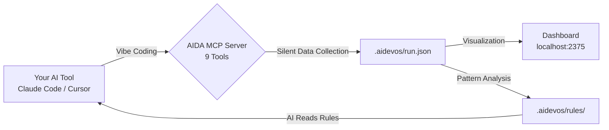

<div align="center">

# AIDA

### Make Vibe Coding Measurable.

Every vibe coding session generates massive insights — deviations, patterns, quality signals.<br>
*But you close the terminal, and all of it vanishes. Next session, you start blind again.*<br>
**AIDA captures every data point, visualizes it in a live dashboard, and distills it into rules that make your AI write better code — every single run.**

One line to integrate. Zero workflow changes.

```json
{ "mcpServers": { "aida": { "command": "npx", "args": ["-y", "ai-dev-analytics", "mcp"] } } }
```

[](https://www.npmjs.com/package/ai-dev-analytics)
[](./LICENSE)
[](https://nodejs.org)
[](#testing)
[](https://lwtlong.github.io/ai-dev-analytics/)

[One-Line Setup](#-30-second-setup) · [Data-Driven Loop](#-the-data-driven-loop) · [Dashboard](#-the-dashboard) · [SOP Workflow](#-standardized-ai-development-workflow) · [Data for Reports](#-data-sedimentation--performance-reports) · [中文文档](./README.zh-CN.md)

</div>

---

## The Insight

Vibe coding is powerful. But it's a black box.

You tell Claude to build a feature. It writes code. You ship it. But you have **zero visibility** into what actually happened:

- How many tasks did AI complete? How long did each take?
- Where did AI deviate from your project conventions? Why?
- Which deviations keep recurring? What rules would prevent them?
- What's the bug rate? Which phases produce the most bugs?

Without data, you can't improve. You're just vibing — over and over, with the same blind spots.

**AIDA makes the invisible visible.** It collects structured data from every vibe coding session, renders it in a real-time dashboard, and turns deviation patterns into project rules. Your AI doesn't just code — it **learns your project**.

---

## 🔄 The Data-Driven Loop

This is the core of AIDA — **data in, rules out, better code next time.**

```
Vibe Coding Session
        ↓
   AIDA silently collects structured data
   (tasks, deviations, bugs, reviews, files, timeline)
        ↓
   Dashboard visualizes patterns
   "9 deviations → 56% hallucination, 44% rule-missing"
        ↓
   Deviation patterns identified → AI creates project rules via skill guidance
   .aidevos/rules/ ← your AI's growing knowledge base
        ↓
   AI reads rules next session → same mistakes eliminated
        ↓
   Repeat — each cycle, AI output gets closer to your expectations
```

**Real data from a production project:**

| Run | Deviations | What happened | Rules sedimented |
|-----|-----------|---------------|-----------------|
| #1 | 23 deviations across 47 tasks | AI misused components, wrong layouts, incorrect API patterns | 6 project-specific rules |
| #2 | **0 repeat deviations** | AI read the rules. Same patterns — zero errors. | — |

The `.aidevos/rules/` directory is your **project-specific AI knowledge base**. It grows with every run. The more you use AI, the smarter it gets at *your* project.

---

## 📊 The Dashboard

**Your entire vibe coding process — structured, visualized, actionable.**


> **[Live Demo →](https://lwtlong.github.io/ai-dev-analytics/)** Real anonymized project data. No install needed.

AIDA captures every dimension of AI-assisted development and turns it into interactive charts:

| What you see | Why it matters |
|---|---|
| **Deviation root cause breakdown** | Know *why* AI fails — rule-missing? hallucination? context gap? |
| **Deviation category distribution** | Know *where* AI fails — layout? components? API? |
| **Deviation & rule trend over time** | Watch deviations drop as rules accumulate |
| **Bug severity distribution** | Track quality — which phases produce critical bugs? |
| **Self-review pass rate trend** | Is AI code getting better or worse over time? |
| **Task completion by phase** | See progress across the full development lifecycle |
| **File modification hotspots** | Which files keep getting changed? Where are the pain points? |
| **Rules table with source mapping** | Every rule links back to the deviation that created it |
| **Full development timeline** | Every task, bug, review, deviation — chronologically |
| **Project overview (team view)** | Cross-branch stats, developer comparison, requirement status |

Every KPI card is clickable — drill down into task details, deviation root causes, review reports, and file changes.

Run `npx ai-dev-analytics dashboard` to see **your own project's data** in seconds.

### 🔒 100% Local. Zero External Requests.

AIDA writes JSON files to `.aidevos/` in your project directory. **The codebase contains zero HTTP calls to external services** — no telemetry, no cloud sync, no analytics, no tracking. Zero runtime dependencies. Your code and data never leave your machine. Period.

---

## ⚡ 30-Second Setup

### One line in `.mcp.json` — that's the entire integration.

```json
{ "mcpServers": { "aida": { "command": "npx", "args": ["-y", "ai-dev-analytics", "mcp"] } } }
```

No SDK. No wrapper. No code changes. Add this to your project root `.mcp.json`, and AIDA starts collecting data the next time your AI writes code. It works silently — zero workflow changes.

> *Tip: For faster startup, run `npm install -g ai-dev-analytics` and change the command to `"aida"`.*

<details>
<summary>Cursor / VS Code Copilot / Windsurf</summary>

**Cursor** `.cursor/mcp.json`:
```json
{
  "mcpServers": {
    "aida": {
      "command": "npx",
      "args": ["-y", "ai-dev-analytics", "mcp"]
    }
  }
}
```

**VS Code Copilot** `.vscode/mcp.json`:
```json
{
  "servers": {
    "aida": {
      "command": "npx",
      "args": ["-y", "ai-dev-analytics", "mcp"]
    }
  }
}
```

**Windsurf** `~/.codeium/windsurf/mcp_config.json`:
```json
{
  "mcpServers": {
    "aida": {
      "command": "npx",
      "args": ["-y", "ai-dev-analytics", "mcp"]
    }
  }
}
```
</details>

### See your data

```bash
npx ai-dev-analytics dashboard
```

Open `http://localhost:2375` — real-time updates via SSE, Chinese/English toggle built in.

---

## 🤔 Why Data Changes Everything

**Without data, every vibe coding session starts from zero. With data, each one builds on the last.**

| Vibing blind | Vibing with data |
|---|---|
| "AI keeps getting layouts wrong" | Dashboard shows: 9 layout deviations, root cause 56% hallucination + 44% rule-missing. 4 rules sedimented → zero repeats next run |
| "I corrected this three times already" | AIDA recorded the deviation pattern. AI created a rule via the deviation-recorder skill. AI reads it every session — you never correct it again |
| "That feature had a lot of bugs" | 5 bugs, 3 critical — all concentrated in one phase. Now you know where to add guardrails |
| "What did I even do this quarter?" | 47 tasks, 23 deviations fixed, 6 rules sedimented, 4064 lines. Export → H1 performance review done |

**Vibe coding without data is just vibing. Add data, and it becomes a compounding system.**

---

## 🎯 Use Cases

**Vibe Coder — "I want my AI to actually learn my project"**
> You've been using Claude Code for a week. AIDA's dashboard shows: 23 deviations, concentrated in `component-usage` and `layout` categories, root cause mostly `rule-missing`. Through the deviation-recorder skill, AI identified patterns and created 6 project rules. Next week, those categories show zero deviations. Your AI now knows your project conventions.

**Tech Lead — "I need to see what AI is actually doing across the team"**
> Team of 4 uses Claude Code daily. Open the project overview: Developer A has 2 deviations + 5 sedimented rules (AI is learning). Developer B has 15 deviations + 0 rules (AI is not learning). The data tells you exactly where to intervene.

**Senior Engineer — "Show me the data for my performance review"**
> End of H1. Open the dashboard: 150 tasks across 3 features, 89% first-pass review rate, 12 rules sedimented that now benefit the entire team. All structured data — export it, attach it to your review doc. Data beats "I think I did a lot."

**Team adopting vibe coding — "How do we go from chaotic to systematic?"**
> Start collecting data. After 2 weeks, the dashboard shows clear patterns: which types of tasks AI handles well, where it consistently deviates, what rules are needed. You go from "AI sometimes works" to "AI works predictably because we've taught it our conventions."

---

## 📁 Data Sedimentation & Performance Reports

AIDA doesn't just visualize — it **sediments**. Every run accumulates structured data that compounds over time.

```
Week 1:  47 tasks, 23 deviations, 5 bugs, 6 rules, 4064 lines
Week 4:  180+ tasks, deviation rate dropping, 15 rules, full quality history
Quarter: Complete development record — exportable, analyzable, presentable
```

**What you can do with sedimented data:**

| Scenario | What you get |
|----------|-------------|
| **H1 / H2 Performance Review** | Tasks completed, quality metrics (pass rate, bug rate), code volume, rules contributed — all with numbers, not feelings |
| **Annual Summary** | Cross-project trends, deviation patterns over time, rule growth curve, total output |
| **Sprint Retrospective** | What went wrong, what rules were added, which phases improved, measurable quality delta |
| **Team Leader Report** | Per-developer stats, deviation hotspots, which modules need better rules, team-wide AI maturity |
| **Project Handover** | Full development history — someone new can see exactly what happened, what rules exist, and why |

All data is structured JSON in `.aidevos/`. No vendor lock-in. Export it, query it, pipe it into any reporting tool. Run `aida report` to generate a summary at any time.

---

## ⚙️ How It Works



Your AI tool calls AIDA's MCP tools automatically as it works. You don't invoke them manually. No prompts to write, no scripts to run — just vibe code as usual.

<details>
<summary>📋 9 MCP Tools (auto-collected)</summary>

| Tool | What it captures |
|------|-----------------|
| `aida_task_start` | Task begins — ID, title, stage, PRD phase |
| `aida_task_done` | Task completed — duration auto-calculated |
| `aida_log_bug` | Bug found — severity, title, related files |
| `aida_bug_fix` | Bug fixed — links fix to original bug |
| `aida_log_review` | Code self-review — pass/fail, issue list |
| `aida_log_deviation` | AI output ≠ expectation — root cause, category |
| `aida_log_files` | File changes — auto-scans `git diff`, zero args needed |
| `aida_highlight` | Notable achievement worth recording |
| `aida_status` | Current run status snapshot |

</details>

### Data Model

All data is local JSON. No database, no cloud.

| Level | File | What it contains |
|-------|------|-----------------|
| **Run** | `.aidevos/runs/{branch}/{dev}/run.json` | Every task, bug, deviation, review, file change |
| **Branch** | `.aidevos/runs/{branch}/requirement.json` | Aggregated stats per requirement |
| **Project** | `.aidevos/index.json` | Cross-branch overview for team leads |
| **Rules** | `.aidevos/rules/` | Sedimented project rules — your AI's growing knowledge base |

All structured JSON — ready for export, analysis, or feeding into reports.

---

## 🚀 Standardized AI Development Workflow

Beyond data collection, AIDA provides a **complete SOP for AI-assisted development** — a standardized workflow that turns chaotic vibe coding into a repeatable, measurable process.

```bash
aida init    # Select "Full workflow"
aida start   # Create a development run
```

This enables **14 AI Skills** orchestrated as a full development pipeline:

```
PRD Ingestion → Requirement Analysis → Task Decomposition
        ↓
Code Generation → Self-Review → Bug Fix → Deviation Fix
        ↓
Data Collection → Pattern Analysis → Rule Sedimentation
        ↓
Next Run: AI reads rules → better output → fewer deviations
```

| Phase | What AI does | What AIDA records |
|-------|-------------|-------------------|
| **Requirement** | Parses PRD, extracts modules and phases | PRD phases, scope |
| **Task Split** | Breaks requirements into atomic tasks | Task list, stages, estimates |
| **Code Gen** | Generates code per task | Files changed, lines added, duration |
| **Self-Review** | Reviews its own output against conventions | Pass/fail, issue list, quality score |
| **Bug Fix** | Fixes bugs found during review | Bug severity, fix details, related files |
| **Deviation Fix** | Corrects output that doesn't match expectations | Root cause, category, new rule (when root cause is rule-missing) |

Every step produces structured data. Every deviation can become a rule. The SOP ensures nothing falls through the cracks — and the data makes the whole process visible and improvable.

---

<details>
<summary>🖥 CLI Reference</summary>

```bash
aida init              # Interactive project setup
aida start             # Create a new development run
aida status            # Show current run status
aida dashboard         # Launch dashboard (default port 2375)
aida dashboard --port 3000 # Custom port
aida mcp               # Start MCP server (for AI tool config)
aida log <subcommand>  # Write structured data (task, bug, review, etc.)
aida reindex           # Rebuild project-level index
aida report            # Generate performance report
aida rules build       # Generate rule view files from registry
aida rules dedupe      # Find and remove near-duplicate rules
aida rules merge       # Merge rules from parallel branches
aida update            # Update skills to latest version
aida migrate           # Migrate old data to current schema
```

</details>

<details>
<summary>🔌 MCP Integration Details</summary>

AIDA uses [Model Context Protocol](https://modelcontextprotocol.io/) — the standard way for AI tools to interact with external systems. The MCP server runs over stdio with zero dependencies.

**What happens when you add the config:**

1. Your AI tool discovers AIDA's 9 tools via MCP
2. As the AI works, it naturally calls `aida_task_start`, `aida_log_files`, etc.
3. Data flows into `run.json` silently
4. Deviation patterns emerge → AI creates rules via skill guidance
5. AI reads rules next session → output quality improves

**No prompts to write. No scripts to run. No workflow to learn.**

</details>

---

## Roadmap

- [ ] Export reports as PDF / HTML (H1/H2 performance reviews)
- [ ] Historical trend analysis — deviation reduction curves over time
- [ ] Team dashboard with multi-project aggregation
- [ ] VS Code extension for inline deviation alerts
- [ ] Cross-project rule sharing — team-wide AI knowledge base

---

## Tech Stack

| | |
|---|---|
| **Runtime** | Node.js + TypeScript, zero dependencies |
| **Dashboard** | React 19 + ECharts + Tailwind CSS 4 |
| **Protocol** | MCP over stdio (JSON-RPC 2.0) |
| **Data** | Local JSON files, no database |
| **Real-time** | Server-Sent Events (SSE) |
| **i18n** | Chinese / English, switchable in dashboard |

## Testing

```bash
npm test    # 82 tests across 29 suites
```

## Contributing

Issues, feature requests, and PRs are welcome.

```bash
git clone https://github.com/LWTlong/ai-dev-analytics.git
cd ai-dev-analytics
npm install
npm test
```

## License

[MIT](./LICENSE)

---

<div align="center">

**Vibe coding without data is just vibing.**<br>
**Add data, and your AI gets smarter every run.**

[Get Started in 30 Seconds →](#-30-second-setup)

</div>
