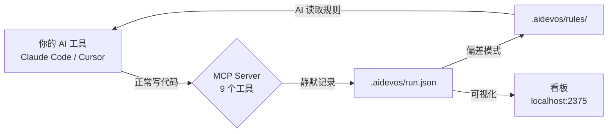

<div align="center">

# AIDA

### AI 总是犯同样的错。AIDA 让它不再犯。

每个 AI 编程工具都会幻觉、误用组件、无视项目规范。<br>
*但你关掉终端，证据就消失了。下次对话，同样的错误重来一遍。*<br>
**AIDA 记录每一个偏差，发现规律，沉淀为规则 —— 让你的 AI 每次运行都变得更聪明。**

```bash
npx ai-dev-analytics init
```

[](https://www.npmjs.com/package/ai-dev-analytics)
[](./LICENSE)
[](https://nodejs.org)
[](#测试)
[](https://lwtlong.github.io/ai-dev-analytics/)

[30 秒上手](#-30-秒上手) · [自进化闭环](#-自进化闭环) · [你能看到什么](#-你能看到什么) · [使用场景](#-使用场景) · [English](./README.md)

</div>

---

## 痛点

你用 Claude 写了一周代码，然后你发现：

- **表单布局又错了。** 上次就是 `labelPosition` 写错，上上次也是。AI 根本不记得。
- **组件又用错了。** 项目规范是用 `FormPageLayout`，AI 偏偏用 `PageLayout`。你纠正了两次了，第三次它还是犯。
- **间距又不对。** 设计规范是 `8px`，AI 每次都生成 `20px`。每个 PR 都要改同一个东西。

根本原因：**AI 没有对自身错误的记忆。** 每次对话都从零开始。

AIDA 改变这一点。它记录哪里出了错、为什么出错，自动构建项目专属的规则集，AI 下次读取规则后 —— **同样的错误不再发生。**

---

## 🔄 自进化闭环

这是 AIDA 的核心 —— 不只是记录，而是让 AI 学习。

```
AI 生成代码 → AIDA 记录偏差（实际产出 vs 期望）
                              ↓
              识别根因 → "规则缺失" / "幻觉" / "上下文不足"
                              ↓
              发现规律 → 自动沉淀为项目规则
                              ↓
              AI 下次读取 .aidevos/rules/ → 同样的错误被消除
```

**来自真实生产项目的数据：**

| 运行 | 偏差 | 发生了什么 | 沉淀的规则 |
|------|------|-----------|-----------|
| #1 | DEV-02 | AI 用了 `labelPosition: 'right'` | "编辑表单必须用 `labelPosition: 'top'`" |
| #1 | DEV-03 | AI 把属性包在 `:formProps={}` 里 | "FormJ 属性必须直接以 attrs 传入" |
| #1 | DEV-05 | AI 用 `PageLayout` 做详情页 | "详情页必须用 `FormPageLayout`" |
| #1 | DEV-20 | AI 在 `onActivated` 里无条件刷新 | "列表刷新必须用事件总线，禁止 `onActivated`" |
| #2 | — | **零重复偏差。** AI 读了规则。 | — |

47 个任务、23 个偏差之后，这个项目沉淀了 6 条规则。第二轮运行中，相同模式的错误**归零**。

你的 `.aidevos/rules/` 目录会逐渐长成一个**项目专属的 AI 知识库**，每次运行都在进化。

---

## 数据看板

**偏差、Bug、任务、耗时、Token、规则 —— AI 做的一切，结构化可视化。**


> **[在线 Demo →](https://lwtlong.github.io/ai-dev-analytics/)** 真实脱敏项目数据，无需安装。

运行 `npx ai-dev-analytics dashboard`，几秒钟看到**你自己项目的数据**。

<details>
<summary>🔒 隐私：所有数据都在本地</summary>

AIDA 只往项目里的 `.aidevos/` 目录写 JSON 文件。不发遥测、不上传云端、不请求外部服务。你的代码绝不会离开你的电脑。

</details>

---

## ⚡ 30 秒上手

### 已经在用 Claude Code？加一段配置就行。

在项目根目录创建或编辑 `.mcp.json`：

```json
{
  "mcpServers": {
    "aida": {
      "command": "npx",
      "args": ["-y", "ai-dev-analytics", "mcp"]
    }
  }
}
```

搞定。AIDA 在首次使用时自动创建一切。零工作流改变 —— AI 在工作时静默调用 MCP 工具。

> *提示：npm 下载慢的话，先 `npm install -g ai-dev-analytics`，然后把 command 改成 `"aida"`。*

<details>
<summary>Cursor / VS Code Copilot / Windsurf 配置</summary>

**Cursor** `.cursor/mcp.json`：
```json
{
  "mcpServers": {
    "aida": {
      "command": "npx",
      "args": ["-y", "ai-dev-analytics", "mcp"]
    }
  }
}
```

**VS Code Copilot** `.vscode/mcp.json`：
```json
{
  "servers": {
    "aida": {
      "command": "npx",
      "args": ["-y", "ai-dev-analytics", "mcp"]
    }
  }
}
```

**Windsurf** `~/.codeium/windsurf/mcp_config.json`：
```json
{
  "mcpServers": {
    "aida": {
      "command": "npx",
      "args": ["-y", "ai-dev-analytics", "mcp"]
    }
  }
}
```
</details>

### 打开看板

```bash
npx ai-dev-analytics dashboard
```

打开 `http://localhost:2375` —— SSE 实时推送，内置中英文切换。

---

## 🤔 为什么需要这个

**AI 不会从错误中学习。你需要一个系统替它做这件事。**

| 没有 AIDA | 有 AIDA |
|---|---|
| "AI 布局又写错了" | "9 个布局偏差，根因：幻觉 56%，规则缺失 44%。已沉淀 4 条规则 → 零重复" |
| "这个错误我纠正三次了" | "DEV-03 已自动沉淀：'FormJ 属性必须直接传入'。AI 每次都会读" |
| "那个功能 Bug 挺多的" | "5 个 Bug，3 个严重 —— 全集中在数据库迁移阶段。Bug 率 10.6%" |
| "这个季度我到底干了什么？" | "47 个任务、23 个偏差修复、6 条规则沉淀、4064 行代码。导出 → H1 绩效汇报" |

区别在于：**不断遗忘的 AI vs. 持续积累知识的 AI。**

---

## 📊 你能看到什么

### 偏差与质量分析

| 分类 | 指标 |
|------|------|
| **偏差分析** | 根因分布（规则缺失 / 幻觉 / 上下文不足）、偏差分类分布、趋势变化 |
| **Bug 追踪** | 严重度分布、来源分析、Bug 率、修复耗时 |
| **审查质量** | 自检通过率趋势、问题类型分布、首次通过率 |
| **规则** | 已沉淀规则列表、来源偏差映射、分类覆盖度 |

### 开发生命周期

| 分类 | 指标 |
|------|------|
| **任务** | 各阶段完成情况、耗时 TOP 10、阶段时间分布 |
| **文件** | 修改热点、新增/删除行数、变更频率 |
| **时间线** | 完整开发历史 —— 每个任务、Bug、审查、偏差，按时间排列 |
| **Token** | 总量、input/output/cache 拆分、每任务消耗 |

### 项目维度（给团队看）

- 需求状态总览
- 开发者效率对比
- 跨分支聚合统计

每个 KPI 卡片都可点击 —— 下钻到任务详情、偏差根因、自检报告、文件变更。

### 可导出的数据

所有数据都是结构化 JSON，随时可以拉取：
- **H1 / H2 绩效汇报** —— 任务完成量、质量指标、代码行数
- **年度总结** —— 跨项目趋势、偏差模式、规则增长曲线
- **Sprint 回顾** —— 哪里出了问题、新增了哪些规则、质量提升了多少
- **团队 Leader 看板** —— 谁的偏差最多？哪个模块需要更好的规则？

---

## 🎯 使用场景

**Vibe Coder —— "为什么 AI 总是犯同样的错？"**
> AI 反复误用你的组件库。用了一周 AIDA，看板显示：9 个偏差，全是 `component-usage` 分类，根因 `rule-missing`。AIDA 沉淀了 3 条规则。下一轮运行，AI 读了规则 —— 零组件误用。

**技术负责人 —— "谁的 AI 工作流需要调优？"**
> 团队 4 个人每天用 Claude Code。项目总览：A 同学 2 个偏差 + 5 条规则。B 同学 15 个偏差 + 0 条规则。B 的 AI 没在学习，因为没人记录偏差模式。是时候给 B 配上 AIDA 了。

**高级工程师 —— "绩效汇报要数据"**
> H1 结束了。打开看板：3 个功能共 150 个任务，89% 首次通过率，沉淀 12 条规则让整个团队受益。导出数据，附到绩效文档。数据比"我觉得我干了很多"有说服力。

**开源维护者 —— "AI 生成的代码质量够不够？"**
> 你接受 AI 生成的 PR。AIDA 显示：模板代码 98% 通过率，但 API 设计只有 60%（8 个偏差）。你添加 API 设计规则 —— 下个季度通过率升到 85%。

---

## ⚙️ 工作原理



AI 工具在工作时自动调用 MCP 工具。你不需要手动操作。不用写 prompt，不用跑脚本。

<details>
<summary>📋 9 个 MCP 工具（自动采集）</summary>

| 工具 | 采集什么 |
|------|---------|
| `aida_task_start` | 任务开始 —— ID、标题、阶段、PRD 阶段 |
| `aida_task_done` | 任务完成 —— 自动计算耗时 |
| `aida_log_bug` | 发现 Bug —— 严重度、标题、相关文件 |
| `aida_bug_fix` | 修复 Bug —— 关联到原始 Bug |
| `aida_log_review` | 代码自检 —— 通过/不通过、问题列表 |
| `aida_log_deviation` | AI 产出 ≠ 预期 —— 根因、分类 |
| `aida_log_files` | 文件变更 —— 自动扫描 `git diff`，零参数 |
| `aida_highlight` | 值得记录的亮点 |
| `aida_status` | 当前运行状态快照 |

**Claude Code** 用户还能自动采集 Token 用量 —— input、output、cache creation、cache read token —— 按任务粒度拆分。

</details>

### 数据模型

所有数据都是本地 JSON。不需要数据库，不需要云服务。

| 层级 | 文件 | 内容 |
|------|------|------|
| **运行** | `.aidevos/runs/{分支}/{开发者}/run.json` | 每个任务、Bug、偏差、审查、文件变更、Token |
| **分支** | `.aidevos/runs/{分支}/requirement.json` | 分支聚合统计 |
| **项目** | `.aidevos/index.json` | 跨分支总览 |
| **规则** | `.aidevos/rules/` | 沉淀的项目规则 —— AI 持续增长的知识库 |

---

## 🚀 完整工作流模式

除了数据采集，AIDA 还提供结构化的 AI 开发工作流。

```bash
aida init    # 选择 "Full workflow"
aida start   # 创建开发运行
```

这会启用 14 个 AI Skills —— 需求分析、任务拆分、代码生成、质量自检、Bug 修复 —— 并内置偏差 → 规则的反馈闭环。

---

<details>
<summary>🖥 CLI 命令</summary>

```bash
aida init              # 交互式初始化
aida start             # 创建新的开发运行
aida status            # 查看当前运行状态
aida dashboard         # 启动数据看板（默认端口 2375）
aida dashboard -p 3000 # 自定义端口
aida mcp               # 启动 MCP 服务（供 AI 工具配置）
aida log <子命令>       # 写入结构化数据（task, bug, review 等）
aida reindex           # 重建项目级索引
aida report            # 生成效能报告
aida rules build       # 从注册表生成规则视图文件
aida rules dedupe      # 查找并去除近似重复规则
aida rules merge       # 合并并行分支的规则
aida update            # 更新 Skills 到最新版本
aida migrate           # 迁移旧数据到当前 schema
```

</details>

<details>
<summary>🔌 MCP 集成详情</summary>

AIDA 使用 [Model Context Protocol](https://modelcontextprotocol.io/) —— AI 工具与外部系统交互的标准协议。MCP 服务通过 stdio 运行，零依赖。

**加完配置后发生了什么：**

1. 你的 AI 工具通过 MCP 发现 AIDA 的 9 个工具
2. AI 工作时自然地调用 `aida_task_start`、`aida_log_files` 等
3. 数据静默写入 `run.json`
4. 偏差模式浮现 → 规则被沉淀
5. AI 下次读取规则 → 输出质量提升

**不需要写 prompt。不需要跑脚本。不需要学新的工作流。**

</details>

---

## Roadmap

- [ ] 导出报告为 PDF / HTML（H1/H2 绩效汇报）
- [ ] 历史趋势分析 —— 偏差随时间递减的曲线
- [ ] 多项目聚合的团队看板
- [ ] VS Code 扩展 —— 编辑器内偏差告警
- [ ] Webhook 集成（Slack、Discord、GitHub Issues）
- [ ] 跨项目规则共享 —— 团队级 AI 知识库

---

## 技术栈

| | |
|---|---|
| **运行时** | Node.js + TypeScript，零运行时依赖 |
| **看板** | React 19 + ECharts + Tailwind CSS 4 |
| **协议** | MCP over stdio (JSON-RPC 2.0) |
| **数据** | 本地 JSON 文件，不需要数据库 |
| **实时** | Server-Sent Events (SSE) |
| **国际化** | 中文 / 英文，看板内一键切换 |

## 测试

```bash
npm test    # 82 个测试，29 个测试套件
```

## 参与贡献

欢迎提 Issue、功能建议和 PR。

```bash
git clone https://github.com/LWTlong/ai-dev-analytics.git
cd ai-dev-analytics
npm install
npm test
```

## 许可证

[MIT](./LICENSE)

---

<div align="center">

**AI 不会记住自己的错误。AIDA 会 —— 而且确保它们不再发生。**

[马上试试 →](#-30-秒上手)

</div>
