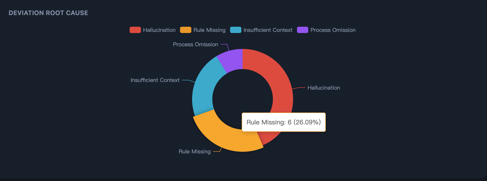
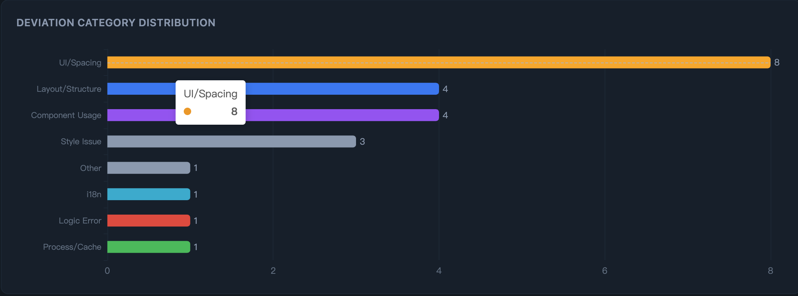
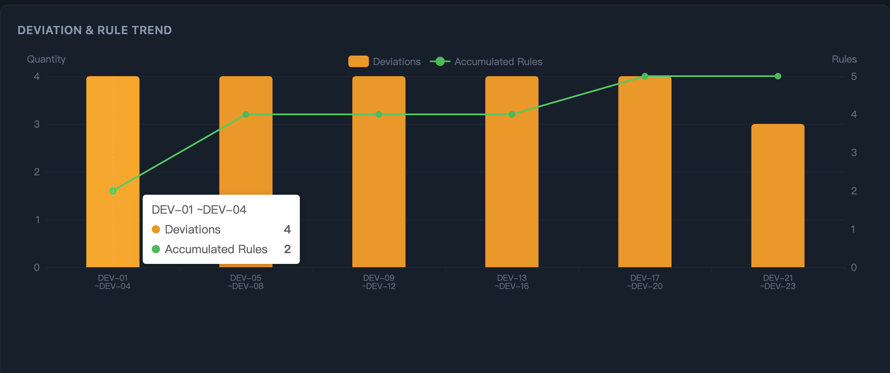
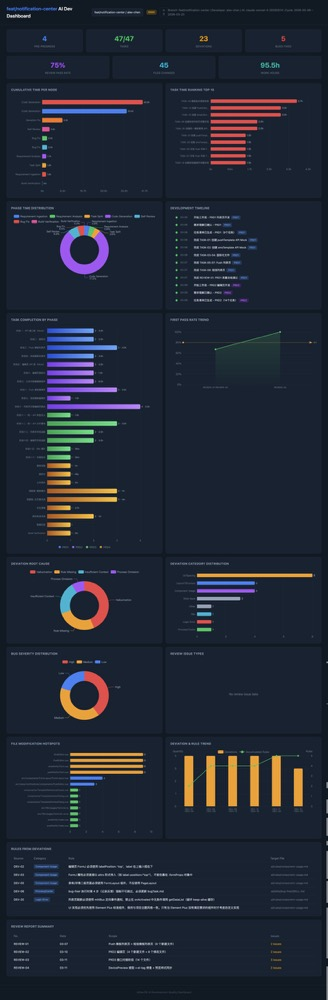
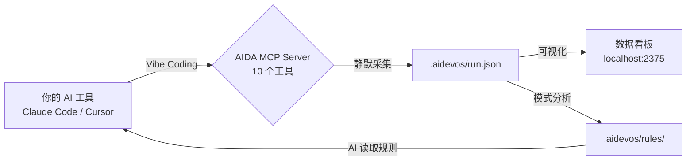

<div align="center">

# AIDA

### 让 Vibe Coding 数据化。

每一次 Vibe Coding 都在产生大量信号 —— 偏差、模式、质量数据。<br>
*但你关掉终端，这些全部消失。下次对话，继续盲写。*<br>
**AIDA 在每个开发节点采集结构化数据，用看板可视化，再把偏差规律沉淀成规则 —— 让你的 AI 每次运行都写出更符合预期的代码。**

一行配置接入，零工作流改变。

```json
{ "mcpServers": { "aida": { "command": "npx", "args": ["-y", "ai-dev-analytics", "mcp"] } } }
```

[](https://www.npmjs.com/package/ai-dev-analytics)
[](./LICENSE)
[](https://nodejs.org)
[](#测试)
[](https://lwtlong.github.io/ai-dev-analytics/)

[一行接入](#-30-秒上手) · [数据驱动闭环](#-数据驱动闭环) · [数据看板](#-数据看板) · [SOP 流程](#-标准化-ai-开发流程) · [数据沉淀](#-数据沉淀与绩效汇报) · [English](./README.md)

</div>

---

## 一个洞察

Vibe Coding 很强。但它是一个黑箱。

你让 Claude 写一个功能，它写了，你 ship 了。但你对过程**零可见性**：

- AI 完成了多少任务？每个任务花了多长时间？
- AI 在哪里偏离了你的项目规范？为什么？
- 哪些偏差反复出现？加什么规则能根治？
- Bug 率多少？哪个阶段产出最多 Bug？

没有数据，你就无法改进。你只是在一遍又一遍地 vibe —— 带着同样的盲区。

**AIDA 让不可见变可见。** 它在每次 vibe coding 过程中采集结构化数据，用实时看板渲染，再把偏差模式沉淀成项目规则。你的 AI 不再只是写代码 —— 它**学习你的项目**。

---

## 🔄 数据驱动闭环

这是 AIDA 的核心 —— **数据进来，规则出去，代码越来越好。**

```
Vibe Coding 过程
        ↓
   AIDA 静默采集结构化数据
   （任务、偏差、Bug、自检、文件变更、时间线）
        ↓
   看板可视化呈现规律
   "9 个偏差 → 56% 幻觉, 44% 规则缺失"
        ↓
   发现偏差规律 → AI 建议沉淀规则 → 用户确认 → 写入规则库
   .aidevos/rules/ ← 你的 AI 知识库在成长
        ↓
   AI 下次读取规则 → 同样的错误被消除
        ↓
   循环往复 —— 每一轮，AI 输出都更接近你的预期
```

**来自真实生产项目的数据：**

| 运行 | 偏差情况 | 发生了什么 | 沉淀的规则 |
|------|---------|-----------|-----------|
| 第 1 轮 | 47 个任务产生 23 个偏差 | AI 组件用错、布局写反、API 模式不对 | 沉淀 6 条项目专属规则 |
| 第 2 轮 | **零重复偏差** | AI 读了规则，相同模式的错误归零 | — |

**第一步：看清 AI *为什么*出错** —— 根因分布一目了然：是 AI 幻觉、规则缺失、还是上下文不足？

<div align="center">
  
</div>

**第二步：看清 AI *在哪*出错** —— 类别分布精准定位：UI 间距、布局结构、组件使用、API 模式。

<div align="center">
  
</div>

**第三步：看规则的复利效应** —— 随着规则积累（绿色线），同类偏差模式不再复现。

<div align="center">
  
</div>

`.aidevos/rules/` 目录就是你的**项目专属 AI 知识库**。用 AI 写得越多，它对*你的项目*就越懂。

---

## 📊 数据看板

**你的整个 Vibe Coding 过程 —— 结构化、可视化、可操作。**

<div align="center">
  <a href="./docs/dashboard.png">
    
  </a>
</div>

> **[在线 Demo →](https://lwtlong.github.io/ai-dev-analytics/)** 真实脱敏数据，无需安装。

AIDA 全方位采集 AI 辅助开发的每个维度，转化为交互式图表：

| 你能看到什么 | 为什么重要 |
|---|---|
| **偏差根因分布** | 知道 AI *为什么*出错 —— 规则缺失？幻觉？上下文不足？ |
| **偏差类别分布** | 知道 AI *在哪*出错 —— 布局？组件？API？ |
| **偏差 & 规则趋势图** | 看着偏差随规则积累而下降 |
| **Bug 严重度分布** | 追踪质量 —— 哪个阶段产出严重 Bug？ |
| **自检通过率趋势** | AI 代码质量是在变好还是变差？ |
| **各阶段任务完成** | 看到完整开发生命周期的进度 |
| **文件修改热点** | 哪些文件反复被改？痛点在哪？ |
| **规则溯源表** | 每条规则都关联到产生它的偏差 |
| **完整开发时间线** | 每个任务、Bug、审查、偏差 —— 按时间排列 |
| **项目总览（团队视角）** | 跨分支统计、开发者对比、需求状态 |

每个 KPI 卡片都可点击 —— 下钻到任务详情、偏差根因、自检报告、文件变更。

运行 `npx ai-dev-analytics dashboard`，几秒钟看到**你自己项目的数据**。

### 🔒 100% 本地。零外部请求。

AIDA 只往项目里的 `.aidevos/` 目录写 JSON 文件。**整个代码库不包含任何外部 HTTP 请求** —— 不发遥测、不上传云端、不请求分析服务、不做任何追踪。零运行时依赖。你的代码和数据绝不会离开你的电脑。

---

## ⚡ 30 秒上手

### 在 `.mcp.json` 里加一行 —— 这就是全部的接入成本。

```json
{ "mcpServers": { "aida": { "command": "npx", "args": ["-y", "ai-dev-analytics", "mcp"] } } }
```

不需要 SDK，不需要包装器，不需要改代码。把这行加到项目根目录的 `.mcp.json`，AI 下次写代码时 AIDA 就开始采集数据。完全静默 —— 零工作流改变。

> *提示：npm 下载慢的话，先 `npm install -g ai-dev-analytics`，然后把 command 改成 `"aida"`。*

<details>
<summary>Cursor / VS Code Copilot / Windsurf 配置</summary>

**Cursor** `.cursor/mcp.json`：
```json
{
  "mcpServers": {
    "aida": {
      "command": "npx",
      "args": ["-y", "ai-dev-analytics", "mcp"]
    }
  }
}
```

**VS Code Copilot** `.vscode/mcp.json`：
```json
{
  "servers": {
    "aida": {
      "command": "npx",
      "args": ["-y", "ai-dev-analytics", "mcp"]
    }
  }
}
```

**Windsurf** `~/.codeium/windsurf/mcp_config.json`：
```json
{
  "mcpServers": {
    "aida": {
      "command": "npx",
      "args": ["-y", "ai-dev-analytics", "mcp"]
    }
  }
}
```
</details>

### 打开看板

```bash
npx ai-dev-analytics dashboard
```

打开 `http://localhost:2375` —— SSE 实时推送，内置中英文切换。

---

## 🤔 为什么数据改变一切

**没有数据，每次 Vibe Coding 都从零开始。有了数据，每次都在上一次的基础上进化。**

| 盲目 vibe | 数据驱动 vibe |
|---|---|
| "AI 布局又写错了" | 看板显示：9 个布局偏差，根因 56% 幻觉 + 44% 规则缺失。沉淀 4 条规则 → 下一轮零重复 |
| "这个错误我纠正三次了" | AIDA 记录了偏差模式，AI 检测到 `rule-missing`，建议沉淀规则，你确认后写入 —— AI 每次都读，你再也不用纠正 |
| "那个功能 Bug 挺多的" | 5 个 Bug，3 个严重 —— 全集中在同一个阶段。现在你知道该在哪里加防线了 |
| "这个季度我到底干了什么？" | 47 个任务、23 个偏差修复、6 条规则沉淀、4064 行代码。导出 → H1 绩效汇报搞定 |

**没有数据的 Vibe Coding 只是在 Vibe。有了数据，才是复利系统。**

---

## 🎯 使用场景

**Vibe Coder —— "我想让 AI 真正学会我的项目"**
> 用 Claude Code 一周了。打开 AIDA 看板：23 个偏差，集中在 `组件使用` 和 `布局` 类别，根因大部分是 `规则缺失`。AI 识别偏差模式并建议沉淀规则，你确认后写入了 6 条项目规则。下一周，这些类别偏差归零。AI 现在懂你的项目规范了。

**技术负责人 —— "我要看到 AI 在团队里到底干了什么"**
> 4 个人每天用 Claude Code。打开项目总览：A 同学 2 个偏差 + 5 条规则（AI 在学习）。B 同学 15 个偏差 + 0 条规则（AI 没在学）。数据告诉你该介入哪里。

**高级工程师 —— "绩效汇报要数据"**
> H1 结束了。打开看板：3 个功能共 150 个任务，89% 首次通过率，沉淀 12 条规则让整个团队受益。全是结构化数据 —— 导出，附到绩效文档。数据比"我觉得我干了很多"有说服力。

**团队落地 Vibe Coding —— "怎么从无序到有序？"**
> 先采集数据。两周后看板上模式很清晰：哪类任务 AI 处理得好，哪里总是偏差，需要什么规则。你从"AI 有时候能用"变成"AI 稳定能用，因为我们用数据教会了它我们的规范"。

---

## 📁 数据沉淀与绩效汇报

AIDA 不只是可视化 —— 它**沉淀数据**。每次运行都积累结构化数据，时间越长价值越大。

```
第 1 周：47 个任务、23 个偏差、5 个 Bug、6 条规则、4064 行代码
第 4 周：180+ 任务、偏差率持续下降、15 条规则、完整质量历史
一个季度：完整的开发记录 —— 可导出、可分析、可汇报
```

**沉淀的数据能干什么：**

| 场景 | 你能拿到什么 |
|------|-------------|
| **H1 / H2 绩效汇报** | 任务完成量、质量指标（通过率、Bug 率）、代码产出、贡献的规则 —— 全是数字，不是感觉 |
| **年度总结** | 跨项目趋势、偏差模式变化、规则增长曲线、总产出统计 |
| **Sprint 回顾** | 哪里出了问题、新增了哪些规则、哪些阶段改善了、可量化的质量变化 |
| **团队 Leader 报告** | 各开发者数据、偏差热点、哪个模块需要更好的规则、团队 AI 成熟度 |
| **项目交接** | 完整开发历史 —— 接手的人能看到做了什么、有什么规则、为什么有这些规则 |

所有数据都是 `.aidevos/` 里的结构化 JSON。没有厂商锁定。随时导出、查询、接入任何报表工具。运行 `aida report` 随时生成汇总。

---

## ⚙️ 工作原理



AI 工具在工作时自动调用 MCP 工具。你不需要手动操作 —— 像往常一样 vibe code 就行。

<details>
<summary>📋 10 个 MCP 工具（自动采集）</summary>

| 工具 | 采集什么 |
|------|---------|
| `aida_task_start` | 任务开始 —— ID、标题、阶段、PRD 阶段 |
| `aida_task_done` | 任务完成 —— 自动计算耗时 |
| `aida_log_bug` | 发现 Bug —— 严重度、标题、相关文件 |
| `aida_bug_fix` | 修复 Bug —— 关联到原始 Bug |
| `aida_log_review` | 代码自检 —— 通过/不通过、问题列表 |
| `aida_log_deviation` | AI 产出 ≠ 预期 —— 根因、分类 |
| `aida_log_files` | 文件变更 —— 自动扫描 `git diff`，零参数 |
| `aida_highlight` | 值得记录的亮点 |
| `aida_status` | 当前运行状态快照 |
| `aida_log_rule` | 沉淀项目规则 —— 用户确认后，AI 调用此工具写入规则 |

</details>

### 数据模型

所有数据都是本地 JSON。不需要数据库，不需要云服务。

| 层级 | 文件 | 内容 |
|------|------|------|
| **运行** | `.aidevos/runs/{分支}/{开发者}/run.json` | 每个任务、Bug、偏差、审查、文件变更 |
| **分支** | `.aidevos/runs/{分支}/requirement.json` | 分支聚合统计 |
| **项目** | `.aidevos/index.json` | 跨分支总览 |
| **规则** | `.aidevos/rules/` | 沉淀的项目规则 —— AI 持续增长的知识库 |

全是结构化 JSON —— 随时可导出、可分析、可生成汇报。

---

## 🚀 标准化 AI 开发流程

除了数据采集，AIDA 还提供**一套完整的 AI 辅助开发 SOP** —— 把无序的 vibe coding 变成可重复、可度量的标准化流程。

```bash
aida init    # 选择 "Full workflow"
aida start   # 创建开发运行
```

启用 **14 个 AI Skills**，编排为完整的开发流水线：

```
PRD 接入 → 需求分析 → 任务拆分
        ↓
代码生成 → 自检审查 → Bug 修复 → 偏差修复
        ↓
数据采集 → 模式分析 → 规则沉淀
        ↓
下一轮：AI 读取规则 → 更好的输出 → 更少的偏差
```

| 阶段 | AI 做什么 | AIDA 记录什么 |
|------|----------|--------------|
| **需求** | 解析 PRD，提取模块和阶段 | PRD 阶段、范围 |
| **任务拆分** | 将需求分解为原子任务 | 任务列表、阶段、预估 |
| **代码生成** | 按任务生成代码 | 文件变更、代码行数、耗时 |
| **自检审查** | 对照规范审查自身输出 | 通过/不通过、问题列表、质量评分 |
| **Bug 修复** | 修复审查中发现的缺陷 | Bug 严重度、修复详情、关联文件 |
| **偏差修复** | 纠正不符合预期的输出 | 根因、分类、新增规则（根因为规则缺失时） |

每个步骤都产出结构化数据。每个偏差都可以变成规则。SOP 确保不遗漏任何环节 —— 数据让整个过程可见、可分析、可持续改进。

---

<details>
<summary>🖥 CLI 命令</summary>

```bash
aida init              # 交互式初始化
aida start             # 创建新的开发运行
aida status            # 查看当前运行状态
aida dashboard         # 启动数据看板（默认端口 2375）
aida dashboard --port 3000 # 自定义端口
aida mcp               # 启动 MCP 服务（供 AI 工具配置）
aida log <子命令>       # 写入结构化数据（task, bug, review 等）
aida reindex           # 重建项目级索引
aida report            # 生成效能报告
aida rules build       # 从注册表生成规则视图文件
aida rules dedupe      # 查找并去除近似重复规则
aida rules merge       # 合并并行分支的规则
aida update            # 更新 Skills 到最新版本
aida migrate           # 迁移旧数据到当前 schema
```

</details>

<details>
<summary>🔌 MCP 集成详情</summary>

AIDA 使用 [Model Context Protocol](https://modelcontextprotocol.io/) —— AI 工具与外部系统交互的标准协议。MCP 服务通过 stdio 运行，零依赖。

**加完配置后发生了什么：**

1. 你的 AI 工具通过 MCP 发现 AIDA 的 10 个工具
2. AI 工作时自然地调用 `aida_task_start`、`aida_log_files` 等
3. 数据静默写入 `run.json`
4. 偏差模式浮现 → AI 建议沉淀规则 → 用户确认 → 写入规则库
5. AI 下次读取规则 → 输出质量提升

**不需要写 prompt。不需要跑脚本。不需要学新的工作流。**

</details>

---

## Roadmap

- [ ] 导出报告为 PDF / HTML（H1/H2 绩效汇报）
- [ ] 历史趋势分析 —— 偏差随规则积累递减的曲线
- [ ] 多项目聚合的团队看板
- [ ] VS Code 扩展 —— 编辑器内偏差告警
- [ ] 跨项目规则共享 —— 团队级 AI 知识库

---

## 技术栈

| | |
|---|---|
| **运行时** | Node.js + TypeScript，零运行时依赖 |
| **看板** | React 19 + ECharts + Tailwind CSS 4 |
| **协议** | MCP over stdio (JSON-RPC 2.0) |
| **数据** | 本地 JSON 文件，不需要数据库 |
| **实时** | Server-Sent Events (SSE) |
| **国际化** | 中文 / 英文，看板内一键切换 |

## 测试

```bash
npm test    # 82 个测试，29 个测试套件
```

## 参与贡献

欢迎提 Issue、功能建议和 PR。

```bash
git clone https://github.com/LWTlong/ai-dev-analytics.git
cd ai-dev-analytics
npm install
npm test
```

## 许可证

[MIT](./LICENSE)

---

<div align="center">

**没有数据的 Vibe Coding 只是在 Vibe。**<br>
**有了数据，你的 AI 每次运行都在进化。**

[马上试试 →](#-30-秒上手)

</div>
