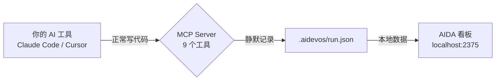

<div align="center">

# AIDA

### AI 写代码是个黑盒。AIDA 让它变得可量化。

你每天用 Claude、Cursor、Copilot 写代码 —— 但你回答不了最基本的问题：<br>
*这个功能烧了多少 Token？哪个任务最慢？AI 到底有没有帮我省钱？*<br>
**别猜了。跑一下 AIDA。看数据说话。**

```bash
npx ai-dev-analytics init
```

[](https://www.npmjs.com/package/ai-dev-analytics)
[](./LICENSE)
[](https://nodejs.org)
[](#测试)
[](https://lwtlong.github.io/ai-dev-analytics/)

[30 秒上手](#-30-秒上手) · [你能看到什么](#-你能看到什么) · [工作原理](#️-工作原理) · [使用场景](#-使用场景) · [English](./README.md)

</div>

---

## 数据看板

**Token 消耗、任务耗时、重试次数、通过率、成本节省 —— 一个页面全看到。**


> **[在线 Demo →](https://lwtlong.github.io/ai-dev-analytics/)** 不用安装，不用配置，打开就能体验。

运行 `npx ai-dev-analytics dashboard`，几秒钟就能看到**你自己项目的真实数据** —— 不是 Demo，是你的实际项目。

<details>
<summary>🔒 隐私：所有数据都在本地</summary>

AIDA 只往项目里的 `.aidevos/` 目录写 JSON 文件。不发遥测、不上传云端、不请求外部服务。你的代码绝不会离开你的电脑。

</details>

---

## ⚡ 30 秒上手

### 已经在用 Claude Code？加一段配置就行。

在项目根目录创建或编辑 `.mcp.json`：

```json
{
  "mcpServers": {
    "aida": {
      "command": "npx",
      "args": ["-y", "ai-dev-analytics", "mcp"]
    }
  }
}
```

搞定。不需要 `npm install`，不需要初始化。AIDA 在首次使用时自动创建一切。

> *提示：如果 npm 下载较慢（尤其是国内网络），可以先 `npm install -g ai-dev-analytics`，然后把 command 从 `"npx"` 改成 `"aida"`，启动会快很多。*

<details>
<summary>Cursor / VS Code Copilot / Windsurf 配置</summary>

**Cursor** `.cursor/mcp.json`：
```json
{
  "mcpServers": {
    "aida": {
      "command": "npx",
      "args": ["-y", "ai-dev-analytics", "mcp"]
    }
  }
}
```

**VS Code Copilot** `.vscode/mcp.json`：
```json
{
  "servers": {
    "aida": {
      "command": "npx",
      "args": ["-y", "ai-dev-analytics", "mcp"]
    }
  }
}
```

**Windsurf** `~/.codeium/windsurf/mcp_config.json`：
```json
{
  "mcpServers": {
    "aida": {
      "command": "npx",
      "args": ["-y", "ai-dev-analytics", "mcp"]
    }
  }
}
```
</details>

### 打开看板

```bash
npx ai-dev-analytics dashboard
```

打开 `http://localhost:2375` —— SSE 实时推送，内置中英文切换。

### 新项目？

```bash
npx ai-dev-analytics init      # 交互式初始化
npx ai-dev-analytics start     # 创建开发运行
# ... 用你的 AI 工具正常写代码 ...
npx ai-dev-analytics dashboard  # 看看发生了什么
```

---

## 🤔 为什么需要这个

**你已经在用 AI 写代码了。但你什么都没在量化。**

| 没有 AIDA | 有 AIDA |
|---|---|
| "我觉得 AI 帮我省了时间" | "AI 完成 47 个任务，处理 95 小时，替代 57 小时人工" |
| "这个月 Token 好像花了不少" | "506K Token，¥17.6 —— 认证模块占了 40%" |
| "那个功能 Bug 挺多的" | "5 个 Bug，3 个严重 —— 全集中在数据库迁移阶段" |
| "AI 总是犯同样的错" | "23 个偏差，首要根因：规则缺失（已自动沉淀为项目规则）" |

区别在于：**凭感觉 vs. 能指导行动的数据。**

---

## 📊 你能看到什么

### 分支维度（开发者视角）

| 分类 | 指标 |
|------|------|
| **Token 消耗** | 总量、input/output/cache 拆分、每任务消耗、成本估算 |
| **时间分析** | 各节点累计耗时、任务耗时 TOP 10、阶段时间分布 |
| **质量** | Bug 严重度分布、偏差根因分析、自检通过率趋势 |
| **效率** | 各阶段任务完成情况、首次通过率趋势、文件修改热点 |
| **成本** | 人工成本 vs AI Token 成本、节省金额、单任务成本拆分 |

### 项目维度（负责人视角）

- 需求状态总览
- 开发者效率对比
- 跨分支聚合统计

每个 KPI 卡片都可点击 —— 下钻到任务详情、偏差根因、自检报告、文件变更、Token 明细。

**一句话：AI 做了什么，全部结构化、可视化。**

---

## 🎯 使用场景

**独立开发者 —— "我的 Token 都花哪儿了？"**
> 周末 vibe coding 了一个功能。周一早上打开看板：300K Token，12 个任务，2 个 Bug 修复。图表显示表单验证任务花了其他任务 5 倍的时间。下次给那部分写清楚 spec。

**技术负责人 —— "AI 到底帮没帮上团队的忙？"**
> 团队 4 个人每天用 Claude Code。项目总览显示：8 个分支共完成 150 个任务，15 个偏差，89% 首次通过率。A 同学 0 偏差，B 同学 9 个。是时候看看 B 的工作流规则了。

**自由职业者 —— "给客户看 ROI"**
> 客户问："为什么要付 AI 工具的钱？"打开成本分析：预估 40 小时人工，AI Token 成本 ¥26.6。节省：¥4,173。截图 → 附到发票里。

**开源维护者 —— "追踪 AI 的贡献质量"**
> 你接受 AI 生成的 PR。AIDA 记录哪些任务是 AI 生成的、自检通过率多少、Bug 率多少。数据驱动：AI 写模板代码没问题（98% 通过率），但设计 API 不太行（60% 通过率）。

---

## ⚙️ 工作原理

```
你的 AI 工具 (Claude Code / Cursor / Windsurf / VS Code)
    │
    │  AI 正常写代码 —— 零工作流改变
    │
    ├──→ MCP Server (9 个工具)    ──→  .aidevos/run.json  ──→  Dashboard
    │    AI 自动调用                    本地 JSON 文件         localhost:2375
    │    零摩擦                         可提交 git             SSE 实时推送
```



AI 工具在工作时自动调用 MCP 工具。你不需要手动操作。不用写 prompt，不用跑脚本。

<details>
<summary>📋 9 个 MCP 工具（自动采集）</summary>

| 工具 | 采集什么 |
|------|---------|
| `aida_task_start` | 任务开始 —— ID、标题、阶段、PRD 阶段 |
| `aida_task_done` | 任务完成 —— 自动计算耗时 |
| `aida_log_bug` | 发现 Bug —— 严重度、标题、相关文件 |
| `aida_bug_fix` | 修复 Bug —— 关联到原始 Bug |
| `aida_log_review` | 代码自检 —— 通过/不通过、问题列表 |
| `aida_log_deviation` | AI 产出 ≠ 预期 —— 根因、分类 |
| `aida_log_files` | 文件变更 —— 自动扫描 `git diff`，零参数 |
| `aida_highlight` | 值得记录的亮点 |
| `aida_status` | 当前运行状态快照 |

**Claude Code** 用户还能自动采集 Token 用量 —— input、output、cache creation、cache read token —— 按任务粒度拆分。

</details>

### 数据模型

所有数据都是本地 JSON。不需要数据库，不需要云服务。

| 层级 | 文件 | 内容 |
|------|------|------|
| **运行** | `.aidevos/runs/{分支}/{开发者}/run.json` | 每个任务、Bug、偏差、审查、文件变更、Token |
| **分支** | `.aidevos/runs/{分支}/requirement.json` | 分支聚合统计 |
| **项目** | `.aidevos/index.json` | 跨分支总览（给负责人看） |

---

## 🚀 进阶：完整工作流模式

除了数据采集，AIDA 还提供结构化的 AI 开发工作流和自进化项目规则。

```bash
aida init    # 选择 "Full workflow"
aida start   # 创建开发运行
```

这会启用 14 个 AI Skills —— 需求分析、任务拆分、代码生成、质量自检、Bug 修复 —— 并带有一个反馈循环，**自动把犯过的错转化为项目规则**。

```
AI 生成代码 → 质量自检发现问题 → 记录为偏差
                                      ↓
                   是不是普遍性问题？ → 沉淀为项目规则
                                      ↓
                   下次 AI 读取规则 → 同样的错误不再发生
```

你的 `.aidevos/rules/` 目录会逐渐长成一个项目专属的 AI 知识库，每次运行都在进化。

---

<details>
<summary>🖥 CLI 命令</summary>

```bash
aida init              # 交互式初始化
aida start             # 创建新的开发运行
aida status            # 查看当前运行状态
aida dashboard         # 启动数据看板（默认端口 2375）
aida dashboard -p 3000 # 自定义端口
aida mcp               # 启动 MCP 服务（供 AI 工具配置）
aida log <子命令>       # 写入结构化数据（task, bug, review 等）
aida reindex           # 重建项目级索引
aida report            # 生成效能报告
aida rules build       # 从注册表生成规则视图文件
aida rules dedupe      # 查找并去除近似重复规则
aida rules merge       # 合并并行分支的规则
aida update            # 更新 Skills 到最新版本
aida migrate           # 迁移旧数据到当前 schema
```

</details>

<details>
<summary>🔌 MCP 集成详情</summary>

AIDA 使用 [Model Context Protocol](https://modelcontextprotocol.io/) —— AI 工具与外部系统交互的标准协议。MCP 服务通过 stdio 运行，零依赖。

**加完配置后发生了什么：**

1. 你的 AI 工具通过 MCP 发现 AIDA 的 9 个工具
2. AI 工作时自然地调用 `aida_task_start`、`aida_log_files` 等
3. 数据静默写入 `run.json`
4. 你随时打开看板查看数据

**不需要写 prompt。不需要跑脚本。不需要学新的工作流。**

</details>

---

## Roadmap

- [ ] 多 AI 供应商 Token 成本追踪（OpenAI、Anthropic、Google）
- [ ] 导出报告为 PDF / HTML
- [ ] 多项目聚合的团队看板
- [ ] VS Code 扩展 —— 编辑器内直接看数据
- [ ] Webhook 集成（Slack、Discord、GitHub Issues）
- [ ] 跨运行的历史趋势分析

---

## 技术栈

| | |
|---|---|
| **运行时** | Node.js + TypeScript，零运行时依赖 |
| **看板** | React 19 + ECharts + Tailwind CSS 4 |
| **协议** | MCP over stdio (JSON-RPC 2.0) |
| **数据** | 本地 JSON 文件，不需要数据库 |
| **实时** | Server-Sent Events (SSE) |
| **国际化** | 中文 / 英文，看板内一键切换 |

## 测试

```bash
npm test    # 82 个测试，29 个测试套件
```

## 参与贡献

欢迎提 Issue、功能建议和 PR。

```bash
git clone https://github.com/LWTlong/ai-dev-analytics.git
cd ai-dev-analytics
npm install
npm test
```

## 许可证

[MIT](./LICENSE)

---

<div align="center">

**你已经在 vibe coding 了。现在看看到底发生了什么。**

[马上试试 →](#-30-秒上手)

</div>
