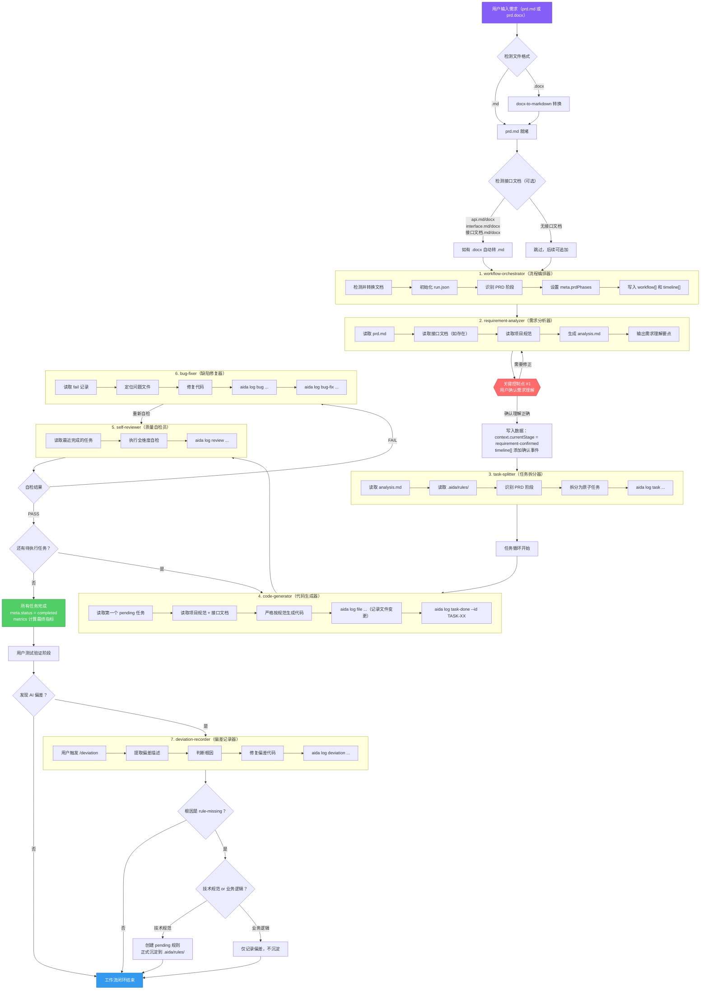
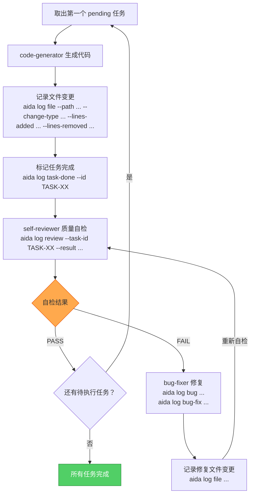
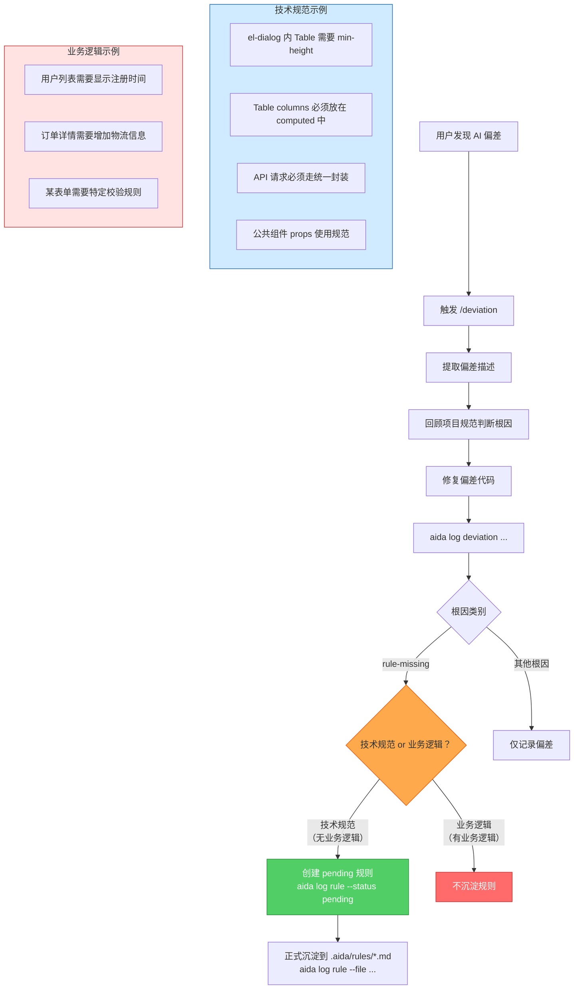
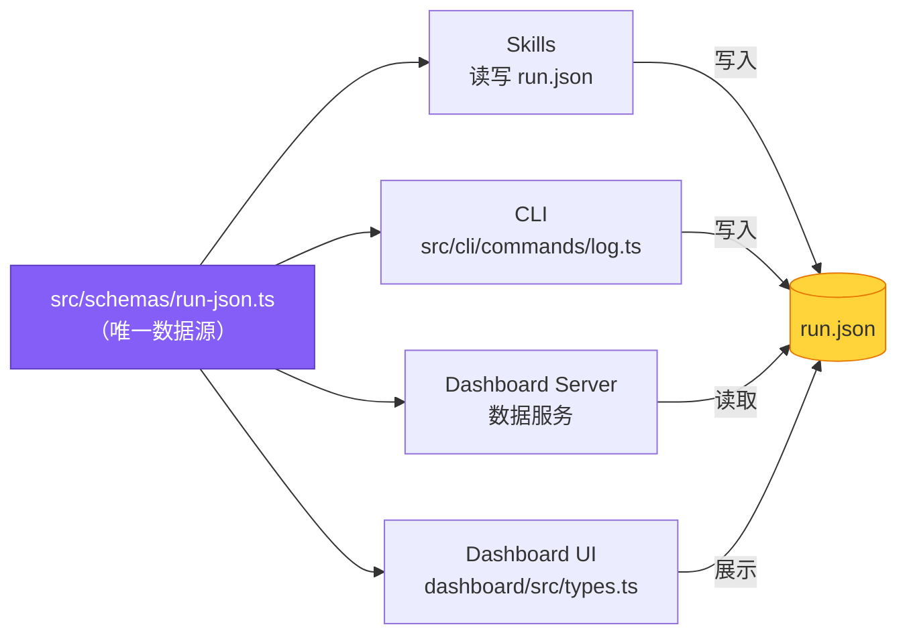

# AIDevOS 流程图（飞书文本绘图格式）

> Historical workflow reference. For the current public CLI and `.aida` asset flow, use [README.md](../README.md) and [COMMANDS.md](../COMMANDS.md) as the canonical docs.

> 以下 Mermaid 代码块可直接粘贴到飞书文档中：
> 输入 `/` → 选择「绘图」 → 粘贴对应代码即可渲染。

---

## 图1：完整工作流程图



---

## 图2：任务执行循环（详细）



---

## 图3：偏差记录与规则沉淀



---

## 图4：数据契约四层一致性



---

## 图5：工程控制论 - 反馈循环


---

## 图6：需求错误成本模型


---

## 使用说明

1. 打开飞书文档
2. 在需要插入流程图的位置输入 `/`
3. 选择「绘图」或「Mermaid」
4. 将上方对应的 mermaid 代码块内容（不含 ` ```mermaid ` 标记）粘贴进去
5. 即可自动渲染为可视化流程图

**推荐插入顺序：**
- 文档开头插入「图1：完整工作流程图」作为全局概览
- 「第2关」小节插入「图2：任务执行循环」
- 「第3关」小节插入「图3：偏差记录与规则沉淀」
- 「数据契约」小节插入「图4：数据契约四层一致性」
- 「工程控制论」小节插入「图5」和「图6」
